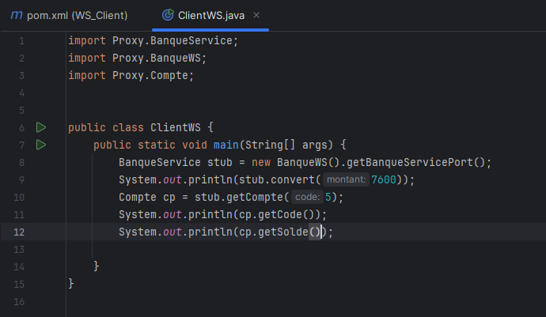

<h1>Compte Rendu</h1>
<h2>Arbre Du WebService</h2>

<h2>Arbre Du Client</h2>

<h2>Method Du WebService</h2>

<h2>WebService Live</h2>

<h2>WSDL Live</h2>

<h2>Test Method Convert</h2>

<h2>Test Method GetCompte</h2>

<h2>Test Method ListCompte</h2>

<h2>STUB</h2>

<h2>STUB Output</h2>

